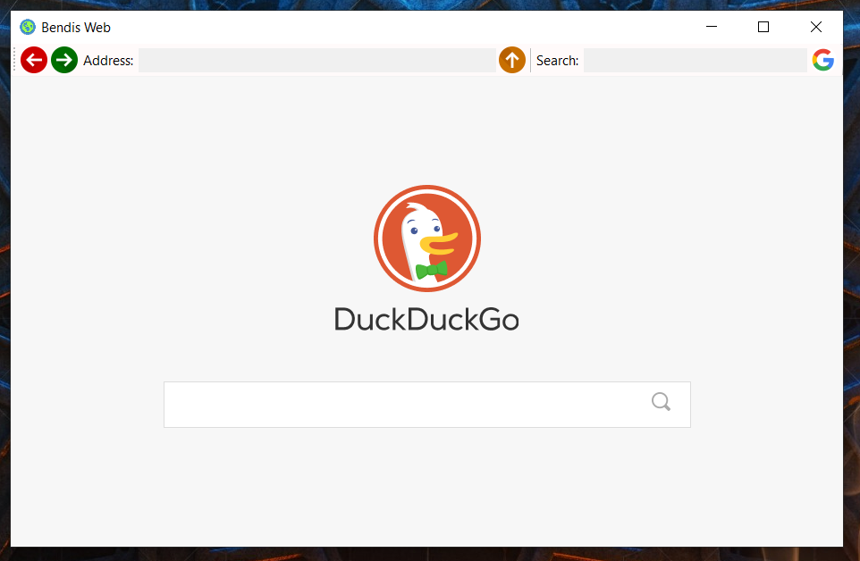

# BendisWeb

BendisWeb is a simple browser application. This application is developed on the .NET platform using Windows Forms. Users can visit web pages, navigate forward and backward and search Google.

## How to Use

After installing the app, you will see a web browser interface in the main window. You can type a URL in the address bar at the top. You can also navigate with the back and forward buttons. If you want to use the Google search engine to search, type the term in the search box and then click on the "Google" button.

## Requirements

- .NET Framework 4.5 or higher

## Installation

1. Clone this repository or download it as a ZIP.
2. Open Visual Studio or similar IDE.
3. Open the project file (`BendisWeb.sln`).
4. Compile and run the project.

## Screenshots

